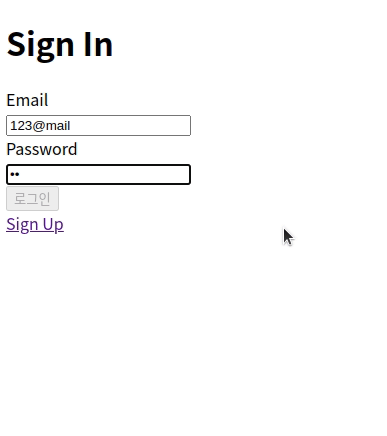
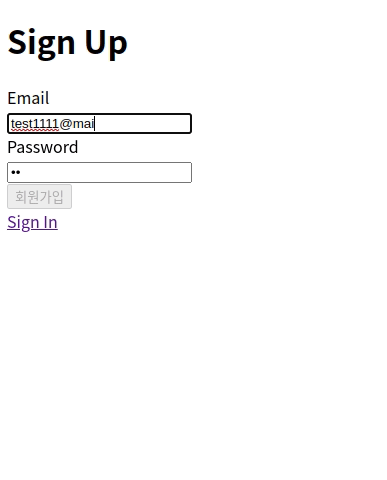
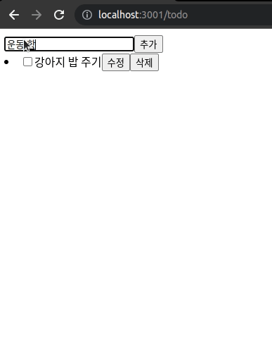
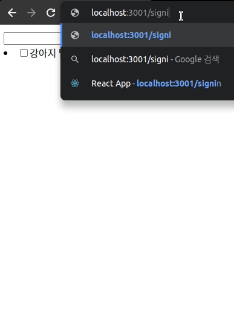

# pre-onboarding-11th-1-7

원티드 프리온보딩 인터십 7팀의 1주 차 과제 팀 레포

팀원 : 김진영, 김동규, 박서희, 윤지현, 조영민, 한주연

- **최종 구현 화면 이미지 / 동영상으로 제공**
- `/signin`
  
- `/signup`
  
- `/todo`
  
- `redirect`
  
- **설치, 환경설정 및 실행 방법**

  ```bash
  git clone https://github.com/pre-onboarding-11th-7/pre-onboarding-11th-1-7.git
  npm install
  npm start
  ```

- **구현 요구 사항 목록**
  - [선발 과제](https://github.com/pre-onboarding-11th-7/pre-onboarding-11th-1-7.git)를 바탕으로 진행하였습니다.
  - **Best Practices**
  - 저희 팀은 다음과 같은 부분을 중점 사항으로 고려하였습니다.
    ### 1. API 요청 관리
    - `axios` 객체를 생성하여 `baseUrl`, `headers` 등 공통 로직으로 처리하였습니다.
    - 각 API 요청을 `custom hook`으로 핸들링하였습니다.
    ### 2. localStorage 관리
    - 해당 프로젝트 규모가 크지 않아 별도의 관리는 하지 않았습니다.
    - 다만, 추후 규모의 확장성이 고려된다면 관리 로직을 생성하기로 하였습니다.
    ### 3. 토큰 유무에 따라 페이지 관리
    - 토큰 인가를 검증하여 `redirect`를 결정하는 레이아웃 컴포넌트를 생성하여 관리하였습니다.
    ### 4. 컴포넌트 분리 관심사
    - 최대한 디자인 시스템과 비즈니스 로직을 분리하였습니다.
    - 반복되는 로직이나 패턴은 `컴포넌트` 혹은 `custom hook`으로 분리하였습니다.
    ### 5. 디렉토리 구조
    ```bash
    - src/
      - api/
      - components/
      - enum/
      - hooks/
      - pages/
      - styles/
      - utils/
    ```
    - 로직과 관심사 별로 디렉토리를 구분하였습니다.
    ### 6. `Eslint` , `Prettier` 설정
    - 코드 스타일의 통일을 위해서 설정하였고, `pre-commit` 을 이용하여 커밋 전 검사를 진행하였습니다.
    - 더 많은 규칙을 정하고 싶었지만, 팀원 모두 평소 잘 이용하지 않아 최소한의 규칙만 적용하였습니다.
    ### 7. Git conventions
    - 커밋 히스토리 관리를 직관적으로 하기 위해서 사전에 `conventions`를 정하였습니다.
    - 이슈와 연결하여 커밋의 마일스톤을 쉽게 확인할 수 있었습니다.
    ### 8. 로그인, 회원가입 등 재사용 가능한 form 컴포넌트
    - 로직이 같은 **로그인**과 **회원가입** `form`의 경우 하나의 컴포넌트로 구성해 재사용성을 높였습니다.
    ### 9. README 작성 양식 - 과제의 디테일 포함 여부에 따른 작성 방식
    - 과제에 중점을 맞춰 저희가 집중한 문제에 대해 서술하도록 현재와 같은 양식을 선정하였습니다.
    ### 10. 에러 예외 처리 방식
    - 다 같이 고려했지만 뚜렷한 명세가 없어 **API 핸들링 훅**에서 전반적인 `try/catch` 를 통해 처리하였습니다.
    ### 11. branch 관련
    - `main` / `dev` / `{convention}/{work name}` 형식으로 관리하였습니다.
    - 각자 개발하는 부분은 `{convention}/{work name}` 브랜치를 생성하여 작업하였습니다.
    - `dev`에서 확실한 동작 확인 후 `main`으로 PR하여 통합했습니다.
- **사용한 프레임워크 및 라이브러리 설명**
  - `CRA`, `TypeScript`, `react-router`, `axios`, `eslint`, `prettier`, `husky`, `lint-staged`
- **한계점 및 개선 사항 작성**
  - 진행 방식의 오류로 인해 과제 수행이 부드럽지 못했습니다.
  - 시간을 촉박하게 사용하여 개발에 임해 팀원 간의 아쉬움이 컸습니다.
  - 이러한 점을 고려하여 **동규**님의 `완벽한 프로젝트 보다는 Best Practice 구현에 중점`을 두자는 의견에 따라 부담을 덜고 프로젝트에 임했습니다.
  - 팀합을 맞추는 첫 협업이기에 완벽한 구현보다는 저희가 생각한 **Best Practice** 구현에 집중했습니다.
  - 아쉬움을 달래기 위해 주말 동안 코드 리뷰 등을 진행하여 의견을 나누기로 했습니다.
